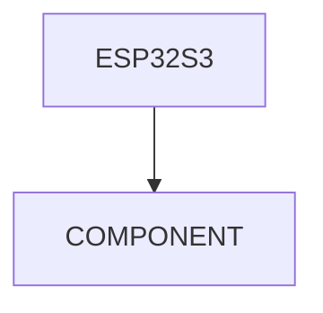
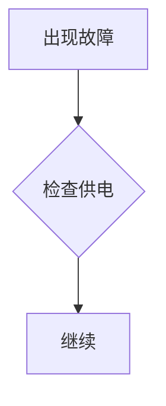

# SparkBot Document Templates

本文档定义本仓库常用文档模板。AI Agent 生成内容时必须优先套用这些模板。

## 1. Component Card Template

路径：

```text
docs/component-cards/<component-name>.md
```

模板：

```markdown
# Component Card: <Component Name>

状态：Draft / Verified / Needs Test / Inference  
风险等级：1/5 ~ 5/5  
适用阶段：P0 / P1 / P2 / P3 / P4

## 1. 它是什么

简要说明该器件是什么，属于哪个模块。

## 2. 它在 SparkBot 中的作用

说明它承担什么功能。

## 3. 为什么需要它

解释为什么这个功能不能省略，或者省略后会损失什么能力。

## 4. 官方设计

记录官方型号、封装、位置、连接方式。

来源：Official / Datasheet / Source Code / Inference / Unknown

## 5. 接口关系

说明它与 ESP32-S3 或其它芯片的连接关系。

可以使用 Mermaid：



## 6. 供电与时钟

- 电源电压：待确认
- 典型电流：待确认
- 时钟来源：待确认

## 7. 固件关系

- ESP-IDF 组件：待确认
- 初始化入口：待确认
- 驱动文件：待确认
- menuconfig 配置：待确认

## 8. 首次验证方法

列出最小验证步骤。

## 9. 常见故障

| 现象 | 可能原因 | 验证方法 |
| --- | --- | --- |
| 待补充 | 待补充 | 待补充 |

## 10. 替代方案

说明是否可替代、替代风险、是否需要改 PCB 或固件。

## 11. 采购建议

- 是否建议原型号：待确认
- 是否可淘宝购买：待确认
- 是否建议立创采购：待确认
- 是否需要核对丝印：待确认

## 12. TODO

- [ ] 核对官方 BOM
- [ ] 核对原理图
- [ ] 核对 PCB 位置
- [ ] 核对固件源码
- [ ] 实机验证

## References

- 待补充
```

---

## 2. Knowledge Template

路径：

```text
docs/knowledge/<topic>.md
```

模板：

```markdown
# Knowledge: <Topic>

状态：Draft  
适用对象：硬件初学者 / 嵌入式开发者 / 固件开发者

## 1. 一句话解释

用一句话说明这个概念。

## 2. 为什么 SparkBot 需要它

说明它在 SparkBot 中出现在哪里。

## 3. 核心概念

列出最重要的 3~7 个概念。

## 4. 在 ESP32-S3 上的实现

说明 ESP32-S3 / ESP-IDF 如何支持它。

## 5. 常见误区

列出初学者容易误解的点。

## 6. 与其它模块的关系


## 7. 实验建议

给出可以实测的小实验。

## 8. TODO

- [ ] 补官方文档链接
- [ ] 补源码示例
- [ ] 补实验结果

## References

- 待补充
```

---

## 3. Failure Case Template

路径：

```text
docs/failure-cases/<number>-<short-name>.md
```

模板：

```markdown
# Failure Case <number>: <Title>

状态：Draft / Verified / Needs Test  
风险等级：1/5 ~ 5/5

## 1. 故障现象

清楚描述用户看到的现象。

## 2. 影响范围

说明影响哪些模块。

## 3. 可能原因排序

按概率从高到低排列。

| 排名 | 可能原因 | 概率 | 损失 |
| --- | --- | --- | --- |
| 1 | 待补充 | 中 | 中 |

## 4. 快速判断

给出第一分钟内能做的判断。

## 5. 排查流程



## 6. 修复方案

列出具体修复步骤。

## 7. 如何预防

说明下次如何避免。

## 8. 相关文档

- 待补充

## 9. TODO

- [ ] 等待实机案例补充
```

---

## 4. Experiment Template

路径：

```text
docs/experiments/exp<number>-<name>.md
```

模板：

```markdown
# Experiment <number>: <Name>

状态：Draft / Running / Completed / Failed  
负责人：Robin / AI Agent / TBD

## 1. 实验目标

说明实验要验证什么。

## 2. 背景

说明为什么要做这个实验。

## 3. 实验环境

- 硬件版本：待确认
- 固件版本：待确认
- ESP-IDF 版本：待确认
- 供电方式：待确认

## 4. 实验步骤

1. 待补充
2. 待补充

## 5. 记录数据

| 项目 | 结果 |
| --- | --- |
| 待补充 | 待补充 |

## 6. 结论

待补充。

## 7. 后续动作

- [ ] 待补充
```

---

## 5. Design Review Template

路径：

```text
docs/design-review/<topic>.md
```

模板：

```markdown
# Design Review: <Topic>

状态：Draft / Inference / Verified

## 1. 被 Review 的设计

说明官方设计点。

## 2. 官方可能的目标

说明该设计试图解决什么问题。

来源：Official / Inference

## 3. 优点

- 待补充

## 4. 缺点或代价

- 待补充

## 5. 替代方案

| 方案 | 优点 | 缺点 | 是否推荐 |
| --- | --- | --- | --- |
| 待补充 | 待补充 | 待补充 | 待补充 |

## 6. 如果重新设计

说明在不同约束下会如何设计。

## 7. TODO

- [ ] 查原理图
- [ ] 查 PCB
- [ ] 查源码
- [ ] 等待实机验证
```

---

## 6. Lesson Template

路径：

```text
docs/lessons/lesson<number>-<title>.md
```

模板：

```markdown
# Lesson <number>: <Title>

预计时间：30~60 分钟  
难度：1/5 ~ 5/5

## 1. 学习目标

完成本课后应该理解什么。

## 2. 前置知识

- 待补充

## 3. 阅读内容

- 待补充

## 4. 实践任务

- [ ] 待补充

## 5. 完成标准

- [ ] 待补充

## 6. 延伸阅读

- 待补充
```

---

## 7. Task Template

路径：

```text
.ai/TASKS.md
```

任务格式：

```markdown
### T0001: <Task Title>

阶段：P0  
类型：docs / hardware / firmware / app / experiment / analysis  
预计耗时：30~60 min  
产出文件：`path/to/file.md`

#### 要求

- [ ] 要求 1
- [ ] 要求 2

#### 完成标准

- [ ] 标准 1
- [ ] 标准 2

#### 建议 Commit

```text
docs(scope): summary
```
```

---

## 8. 模板使用规则

AI Agent 必须：

- 优先使用模板。
- 可以删减不适用的小节，但不能删除“目的/验证/TODO/References”等核心信息。
- 不能生成只有标题没有内容的文件。
- 对不确定内容使用“待确认”，不要编造。