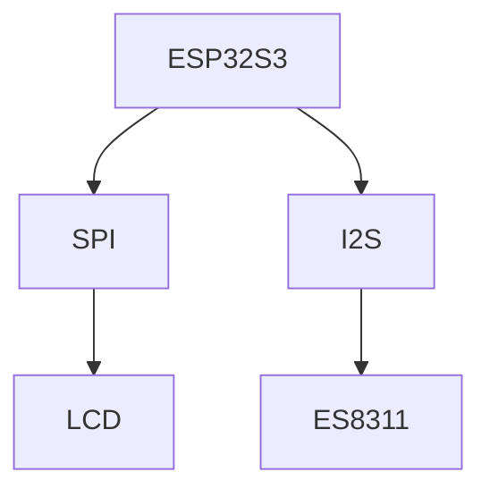

# SparkBot Style Guide

本文档规定本仓库的写作风格、Markdown 结构、术语、图表和引用方式。

## 1. 写作语言

默认使用中文。

技术名词可以保留英文，例如：

- ESP-IDF
- FreeRTOS
- LVGL
- SPI
- I2S
- DMA
- PSRAM
- Codec
- Bring-up

首次出现时建议给出简单解释。

## 2. 写作风格

要求：

- 清楚
- 具体
- 可操作
- 不装腔
- 不空泛
- 不写无意义鸡汤

推荐表达：

```text
首次调试时，先不要接电池。优先使用 USB 供电，并用万用表确认 3.3V 稳定。
```

避免表达：

```text
电源很重要，大家一定要注意。
```

## 3. 文档结构

每篇文档尽量包含：

```text
# 标题

## 目的

## 适用阶段

## 背景

## 核心内容

## 验证方法

## 常见问题

## TODO

## References
```

不是每篇都必须完整，但至少要说明目的和适用阶段。

## 4. 来源标记

重要结论后面使用来源标记：

```text
来源：Official / Datasheet / Source Code / Test / Inference / Unknown
```

示例：

```text
V1.2 修改了 ES8311 相关电路，用于改善大模型对话时扬声器播放卡顿问题。
来源：Official
```

如果是推测，必须写明：

```text
推测：这可能与音频供电或 codec 时钟稳定性有关。
来源：Inference，待原理图验证
```

## 5. 风险等级

统一使用 5 级：

| 等级 | 含义 |
| --- | --- |
| 1 | 很低，基本不影响复刻 |
| 2 | 低，容易修正 |
| 3 | 中，需要提前注意 |
| 4 | 高，可能导致返工 |
| 5 | 极高，可能烧板或损坏器件 |

写法：

```text
风险等级：5/5
```

## 6. 状态标记

统一使用：

- Draft：草稿
- Verified：已验证
- Needs Test：需要实测
- Deprecated：已废弃
- Inference：工程推测

示例：

```text
状态：Needs Test
```

## 7. Mermaid 图

可以使用 Mermaid 表达模块关系。

示例：



要求：

- 图不要过大。
- 优先表达关系，不追求花哨。
- 图后必须有文字解释。

## 8. Markdown 规范

- 一级标题只出现一次。
- 小节不要超过四级标题。
- 表格用于对比，不用于堆砌长段文字。
- 代码块必须标明语言或使用 `text`。
- TODO 使用 GitHub checkbox：`- [ ]`。

## 9. Commit Message 规范

格式：

```text
<type>(<scope>): <summary>
```

推荐 type：

- docs
- analysis
- firmware
- hardware
- app
- chore
- experiment

示例：

```text
docs(component): add ESP32-S3 component card
analysis(audio): analyze ES8311 change in V1.2
docs(failure): add black screen troubleshooting tree
experiment(display): add LVGL FPS test plan
```

避免：

```text
update
fix
add docs
修改一下
```

## 10. 文件命名

文件名统一使用小写英文和连字符：

```text
esp32-s3.md
black-screen.md
first-bringup.md
spi-dma.md
```

不要使用：

```text
ESP32S3.md
黑屏问题.md
new doc.md
```

## 11. 面向读者

默认读者是：

- 会基本电脑操作。
- 有一点编程经验。
- 可能是硬件初学者。
- 愿意使用万用表和焊接工具。

不要默认读者懂：

- 电源拓扑
- I2S
- SPI DMA
- ESP-IDF menuconfig
- PCB layout

但也不要把内容写成儿童科普。目标是“工程师友好的入门解释”。

## 12. 质量检查清单

提交前自查：

- [ ] 这篇文档有没有明确目的？
- [ ] 有没有回答 Why？
- [ ] 有没有区分事实和推测？
- [ ] 有没有给出验证方法？
- [ ] 有没有后续 TODO？
- [ ] 三个月后自己看得懂吗？